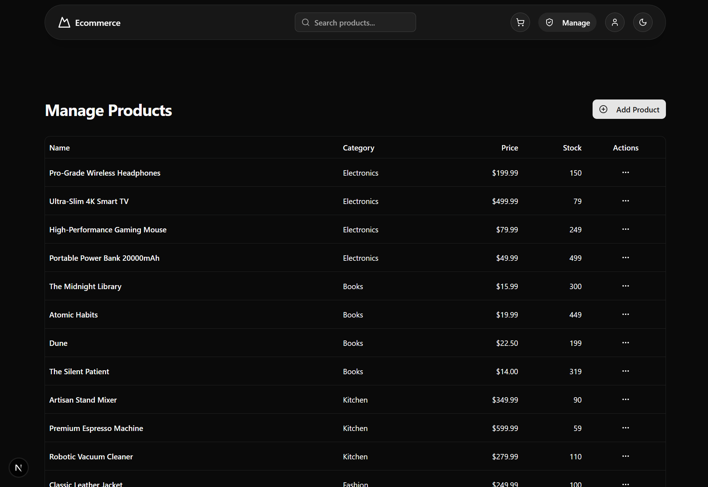

# E-commerce Platform

This is a full-featured e-commerce platform built with [Next.js](https://nextjs.org) and bootstrapped with [`create-next-app`](https://nextjs.org/docs/app/api-reference/cli/create-next-app). It was developed to showcase the implementation of a modern, feature-rich web application for the [DevAcademy-Ecommerce Web API](https://github.com/bernardo-msft/DevAcademy-Ecommerce).

## Project Overview

This project is a comprehensive e-commerce solution that includes user authentication, product browsing, a shopping cart, and an administrative dashboard for viewing sales and customer reports. It is designed to be a robust and scalable application, utilizing modern web development practices and technologies.

## Tech Stack

The project is built using a modern technology stack:

-   **Framework:** Next.js (React)
-   **Language:** TypeScript
-   **Styling:** Tailwind CSS
-   **UI Components:** shadcn/ui
-   **Icons:** Lucide React
-   **Form Management:** React Hook Form
-   **Schema Validation:** Zod
-   **State Management:** React Context API for Auth and Cart
-   **Notifications:** Sonner (for toast notifications)

## Features

The platform includes the following key features:

-   **User Authentication:** Secure user registration and login functionality.
-   **Shopping Cart:** A persistent shopping cart using `Context` to manage state.
-   **Product Catalog:** A page to display and browse products with search and category filtering.
-   **Admin Dashboard:** A protected route for administrators.
-   **CRUD Operations:** Admins can create, read, update, and delete products and categories.
-   **Order Management:** Admins can view all user orders and update their status.
-   **Reporting:**
    -   Monthly sales reports.
    -   Popular products reports.
    -   Top customers reports.
-   **Responsive Design:** The UI is fully responsive and built with a mobile-first approach.

## Application Screenshots

Here are some screenshots of the key pages in the application.

**1. Home Page**


**2. Product Detail Page**


**3. Shopping Cart**


**4. Login Page**


**5. User Orders Page**


**6. Admin - Manage Products**


**7. Admin - Manage Orders**


**8. Admin - Reports Dashboard**


## Project Structure

The codebase is organized into the following directories:

```
/src
|-- /app/           # Next.js App Router pages and layouts
|   |-- /admin/     # Protected admin routes
|   |-- /api/       # API routes (if any)
|   |-- layout.tsx  # Root layout
|   `-- page.tsx    # Main landing page
|-- /components/    # Reusable UI components
|   |-- /layout/    # Layout components (Navbar, Footer)
|   `-- /ui/        # shadcn/ui components
|-- /contexts/      # React Context providers (Auth, Cart)
|-- /lib/           # Utility functions and libraries
`-- /services/      # API service layer for fetching data
```
